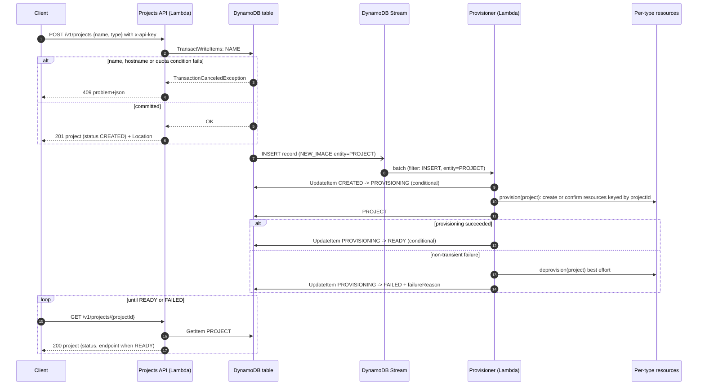

# ADR 0005: Per-type provisioning design (agent, mcp, web)

- **Status:** Proposed
- **Date:** 2026-09-23
- **Related:** [ADR 0002](0002-single-table-design.md) (single table), [ADR 0003](0003-global-name-uniqueness.md)
  (name uniqueness, hostname mapping deferred to this ADR),
  [#25](https://github.com/jameslevine/projects-api/issues/25) (DELETE),
  [#26](https://github.com/jameslevine/projects-api/issues/26) (provisioning pipeline skeleton),
  [#28](https://github.com/jameslevine/projects-api/issues/28) (production environment)

## Context

A project record today is a promise: `POST /v1/projects` stores `{name, type, ownerId}` with
`status = CREATED` and nothing else happens. `ProjectType` is `agent | mcp | web`
([`domain/models.py`](../../src/projects_api/domain/models.py)) and `ProjectStatus` already has
the lifecycle `CREATED -> PROVISIONING -> READY | FAILED`, but no code moves a project past
`CREATED` and no AWS resource exists per project.

**What #26 is implementing (the skeleton this ADR builds on).** DynamoDB Streams is switched on
for the table (`stream_enabled = true`, `NEW_AND_OLD_IMAGES`, a variable that already exists in
[`modules/dynamodb_table`](../../infra/terraform/modules/dynamodb_table/variables.tf)). A second
Lambda function, `projects-api-<env>-provisioner` (python3.12, arm64, built from the same zip as
the API), is subscribed through an event source mapping filtered to `INSERT` events whose new
image has `entity = PROJECT`, batch size 10, bisect on function error, three retries, and an SQS
dead-letter queue with a CloudWatch alarm on its depth. Per record the handler performs a
conditional `UpdateItem` `CREATED -> PROVISIONING`, calls a `Provisioner` protocol selected by
`ProjectType`, then `PROVISIONING -> READY`, or `-> FAILED` with a `failureReason`. Records whose
status is no longer `CREATED` are skipped, which makes redelivery safe. The three `Provisioner`
implementations in #26 are **stubs that return success**. This ADR decides what the real
implementations should create, how names become hostnames, where the tenant boundaries are,
what a project costs, and how teardown and failure work.

Constraints carried over from earlier decisions and the plan:

- Names are globally unique and case-insensitive so they can become hostnames (ADR 0003). The
  allowed character set (`[A-Za-z0-9 _-]`, 3 to 63 characters, alphanumeric at both ends,
  [`domain/validation.py`](../../src/projects_api/domain/validation.py)) is a superset of a DNS
  label; ADR 0003 explicitly deferred the mapping and warned that distinct `nameKey`s could
  collide on a hostname.
- Everything is Terraform, tagged `Project=projects-api`, and guarded by a monthly budget of
  USD 20 in dev. Idle projects must cost close to nothing or the model does not work for a
  service whose users create projects speculatively.
- Identity is an API key id; there is no user directory, no organisations and no roles
  (ADR 0001). Isolation therefore has to be per project (and per owner), enforced by AWS IAM and
  resource design, not by claims.
- The provisioner is a separate function precisely so that the API's own role stays narrow
  (ADR 0004, "Coarse IAM"). Whatever the provisioner is allowed to create must be bounded.
- Delete ([#25](https://github.com/jameslevine/projects-api/issues/25)) removes the record and the
  name reservation in one transaction and returns `204` synchronously; teardown of provisioned
  resources has to fit that contract.

## Options considered

### (a) Dedicated AWS resources per project, created by the provisioner through SDK calls

Each project gets its own stack of primitives: for `web` an S3 bucket plus a CloudFront
distribution; for `mcp` its own API Gateway API or Lambda function URL and function; for
`agent` its own queue, function and role. The provisioner calls the AWS SDK directly and records
ARNs on the project.

- Strongest isolation: separate resource policies, separate throttles, separate logs, and a
  clean teardown (delete everything tagged with the project id).
- Slow and quota-bound. A CloudFront distribution takes minutes to deploy and there are 200 per
  account by default; API Gateway REST APIs are limited to 600 per region; every bucket has a
  global name and a 100-bucket default limit. Two of the three types would hit account quotas at
  a few hundred projects.
- Not free when idle. A distribution is free, but a per-project REST API with a custom domain, a
  per-project certificate, and per-project alarms all add fixed cost or operational noise; a
  Secrets Manager secret per project alone is USD 0.40 a month.
- Most SDK surface for the provisioner role, hence the widest blast radius if it is compromised.

### (b) Shared multi-tenant runtimes with per-project configuration records only

One set of runtime resources per environment (a bucket, a distribution, an API, a function) is
created by Terraform once. Provisioning a project writes configuration: an S3 prefix, a routing
entry, an API key, a DynamoDB item. The shared runtime looks up the project from the request
(host name or key id) and scopes itself at run time.

- Provisioning is fast (seconds), idempotent, and touches few APIs; the provisioner role needs
  only `s3:PutObject` on one bucket, a routing-store write, and API Gateway key operations.
- Idle cost per project is effectively zero; fixed cost is paid once per environment.
- No account-quota pressure until tens of thousands of projects.
- Isolation is logical, enforced in code and in a few resource policies. A bug in the shared
  runtime can leak across tenants, and one noisy project shares throttles and concurrency with
  everyone unless per-project limits are layered on (usage plans, per-prefix request limits).
- Wrong for workloads that execute tenant-specific code or hold tenant secrets in memory: a
  shared execution environment is reused across invocations, so an `agent` running one
  project's tools with one project's credentials in the same process as another's is a real
  cross-tenant risk, not a theoretical one.

### (c) A Terraform or CloudFormation stack per project, driven by the provisioner

The provisioner renders a template per project and runs `terraform apply` (or
`CreateStack`) inside the Lambda, or hands off to CodeBuild.

- Declarative, drift-detectable, and teardown is `DeleteStack`.
- CloudFormation stacks take minutes, Terraform needs a state backend and lock per project and a
  binary in the function; both are far outside a Lambda's comfort zone and make the provisioner
  hard to test with moto.
- Same quota and idle-cost profile as (a), because the stacks contain the same resources.
- Operationally two IaC systems: the platform's Terraform and per-project stacks, with the
  latter created by code rather than reviewed in a PR. That undermines the "everything is a
  reviewed plan" property that the rest of this repository relies on.

## Decision

**Shared runtimes (b) for `web` and `mcp`; dedicated compute (a) for `agent`, restricted to the
primitives that are free when idle and not quota-bound: an SQS queue, a Lambda function and an
IAM role per project.** No per-project Terraform (c) anywhere.

The reasoning is the isolation boundary each type actually needs:

- A `web` project is static content. The tenant boundary is "which prefix may this host name
  read"; that is a routing decision a shared CloudFront distribution makes safely, and static
  content carries no secrets and executes nothing on our side.
- An `mcp` project is a request-response server whose behaviour is configuration (which tools,
  which project-scoped data). The runtime code is ours, identical for every project, and each
  request is scoped by the caller's key. A shared function with per-request scoping is the same
  model the Projects API itself already uses for owners, and per-project API keys give
  per-project throttling for free (ADR 0001).
- An `agent` executes long-running, tenant-specific work with tenant credentials in memory and
  makes outbound calls on the tenant's behalf. Sharing an execution environment across tenants
  is not acceptable there. A Lambda function per project gives a separate execution environment,
  a separate role (so credentials are never even obtainable by another project's code), a
  separate log group and a separate concurrency control, and all of those cost nothing while
  idle. There is no default limit on the number of functions; the binding quota is IAM roles
  (1,000 per account by default, raisable to 5,000), which is why `agent` gets a stricter
  per-owner quota than the other types.

### Per-type design

| Type | Resources when `READY` | Endpoint shape | Isolation boundary | Idle monthly cost estimate | Active cost driver |
|---|---|---|---|---|---|
| `web` | Prefix `<projectId>/` in the shared bucket `projects-api-<env>-web` seeded with a placeholder `index.html`; one entry `<label> -> <projectId>` in the shared CloudFront KeyValueStore; the shared distribution (`*.<domain>` alternate name, ACM wildcard certificate, origin access control to the bucket) and a single wildcard `*.<domain>` DNS record already exist per environment | `https://<label>.<domain>/` (CloudFront Function on viewer-request maps the `Host` header to the origin path `/<projectId>/`) | Prefix in one bucket; the CloudFront Function is the only thing that maps a host to a prefix; the bucket policy allows reads only from the distribution's OAC and writes only from the provisioner and (later) a signed-upload path scoped to the prefix | ~USD 0.00 (S3 storage at about USD 0.024 per GB-month; a placeholder is bytes) | CloudFront requests (~USD 0.012 per 10k HTTPS requests in Europe) and data transfer (~USD 0.085 per GB); S3 GETs |
| `mcp` | One API Gateway API key `projects-api-<env>-mcp-<projectId>` attached to the shared usage plan `projects-api-<env>-mcp-default`; the key **value** in an SSM SecureString parameter `/projects-api/<env>/projects/<projectId>/mcp-key`; a configuration item `PROJECT#<projectId>/PROVISION`; the shared REST API `projects-api-<env>-mcp` (wildcard custom domain `*.mcp.<domain>`, stage `live`, `ANY /{proxy+}` to the shared function `projects-api-<env>-mcp-runtime`) already exists per environment | `https://<label>.mcp.<domain>/mcp` with header `x-api-key: <project key>` (Streamable HTTP transport; request-response only, see Consequences) | The shared runtime resolves `<label>` to a `projectId`, checks that `requestContext.identity.apiKeyId` equals the key id recorded for that project (any mismatch is `404`), and loads only that project's configuration; usage plan throttles per key | ~USD 0.00 (API keys, usage plans and standard SSM parameters are free) | REST API requests (~USD 3.50 per million), Lambda duration on the shared runtime, CloudWatch Logs ingestion |
| `agent` | SQS queue `projects-api-<env>-agent-<projectId>` (plus its DLQ); Lambda function `projects-api-<env>-agent-<projectId>` (python3.12, arm64, deploying the shared agent-runtime package, configured with `PROJECT_ID`); event source mapping queue -> function with `MaximumConcurrency` (default 2); IAM role `/projects-api/<env>/projects/agent-<projectId>` with the platform permissions boundary; log group `/aws/lambda/projects-api-<env>-agent-<projectId>`; a `PROJECT#<projectId>/PROVISION` item recording the ARNs | No public endpoint. Work is submitted through the Projects API (future `POST /v1/projects/{projectId}/runs`, owner-authenticated), which sends to the project's queue; results are read back the same way | Separate function, execution environment, role and log group; the role can read only `/projects-api/<env>/projects/<projectId>/*` parameters and the project's own tagged resources (ABAC), and cannot assume anything else | ~USD 0.00 (functions, queues, roles and empty log groups are free; SQS charges begin after the shared 1 million requests per month) | Lambda duration (~USD 0.0000133 per GB-second on arm64) and requests, SQS requests (~USD 0.40 per million), Logs ingestion; the model or tool APIs the agent calls are billed to the owner's own accounts and are outside this cost model |

Fixed cost per environment, independent of project count: a Route 53 hosted zone (USD 0.50 a
month), the wildcard certificates (free), the shared CloudFront distribution and KeyValueStore
(free when idle; CloudFront Functions about USD 0.10 per million invocations), the shared `mcp`
REST API and runtime (free when idle), the provisioner and its DLQ (free when idle), and WAF if
`enable_waf` is set (about USD 5 per web ACL plus USD 1 per rule per month, as documented in
[`envs/dev/variables.tf`](../../infra/terraform/envs/dev/variables.tf)). Prices are approximate
eu-west-2 list prices at the date of this ADR and are for shape, not budgeting.

Two rules apply to every type:

- **Resource names derive from `projectId`, never from the name.** The label is a routing
  alias resolved at the edge (`web`) or at the runtime (`mcp`). This keeps provisioning
  idempotent (re-running creates the same names), makes a future rename a routing update rather
  than a resource move, and prevents a re-created project with the same name from colliding
  with a predecessor still being torn down.
- **No per-project CloudWatch alarms.** Alarms cost USD 0.10 to 0.30 a month each and would
  dominate idle cost. Per-type health is alarmed on shared metrics (the shared `mcp` API and
  runtime, the sum of agent function errors via a metric-math `SEARCH` over the
  `projects-api-<env>-agent-*` prefix, DLQ depth), and per-project detail comes from the
  per-project log groups and Contributor Insights when needed.

### Naming: `nameKey` to DNS label

`name_key` (ADR 0003) is the lower-cased, whitespace-collapsed name, 3 to 63 characters of
`[a-z0-9 _-]`, alphanumeric at both ends. The hostname label is:

```text
dns_label(nameKey) = nameKey with every space and every underscore replaced by "-"
```

Nothing else changes: no collapsing of hyphen runs, no truncation, no transliteration. The
mapping is one character to one character, so the label is also 3 to 63 characters, which is
exactly the DNS label limit (RFC 1035), and it starts and ends with a letter or digit because
the name rules already require that. With a platform domain of ordinary length the full name
`<label>.mcp.<domain>` stays well under the 253-character hostname limit. `my  Agent_v2` has
`nameKey = my agent_v2` and `dns_label = my-agent-v2`.

**Uniqueness.** `nameKey` uniqueness (ADR 0003) is not enough: `a b`, `a_b` and `a-b` are three
distinct `nameKey`s that map to the one label `a-b`. Exactly as ADR 0003 anticipated, the
create transaction gains a **third conditional put**, a hostname reservation:

```text
TransactItems:
  [0] Put NAME#<nameKey> / RESERVATION          ConditionExpression: attribute_not_exists(PK)
  [1] Put HOST#<dnsLabel> / RESERVATION         ConditionExpression: attribute_not_exists(PK)
  [2] Put PROJECT#<projectId> / META            ConditionExpression: attribute_not_exists(PK)
  [3] Update OWNER#<ownerId> / META             (quota counter, see below)
```

A failed condition on `[0]` or `[1]` is reported as the existing `409`
`project-name-taken` problem; the `detail` for `[1]` says that the name would map to the same
hostname as an existing project. The label is computed in the API, in
`domain/validation.py` next to `name_key`, so that the user learns about the conflict
synchronously and the provisioner only ever recomputes a value that is already reserved. The
`HOST#` item stores `projectId`, `ownerId`, `nameKey` and `createdAt`; the delete transaction
(ADR 0003, `[1]` conditioned on `projectId = :id`) gains the matching conditional delete.

**Reserved labels.** A small list in `domain/validation.py` is rejected at create with `400`:
labels that would shadow platform names (`www`, `api`, `mcp`, `docs`, `health`, `admin`,
`status`, `projects-api`) and any label beginning with `xn--` (reserved by IDNA; a name such as
`xn--foo` passes the character rules but must not become a label). The list is small and
environment-independent; per-tenant prefixes or a claim process remain future work.

**Migration.** Projects created before this change have no `HOST#` item. A one-off backfill
script writes them with the same conditional put; a conflict between two existing projects that
map to the same label is resolved by the operator (the later `createdAt` is marked `FAILED`
with `failureReason = hostname-conflict` and its owner contacted). Dev is the only environment
today, so this is a dev-only exercise.

### Tenant isolation and IAM boundaries

- **Three principals, three roles.** The API role (`projects-api-<env>-role`) keeps its seven
  DynamoDB actions on one table and gains nothing. The provisioner role may: read and update the
  table; `s3:PutObject`/`DeleteObject` on `projects-api-<env>-web/*`; write and delete keys in
  the shared CloudFront KeyValueStore; `apigateway:POST/DELETE/PATCH` on the shared `mcp`
  API's `/apikeys` and `/usageplans/<id>/keys`; `ssm:PutParameter/DeleteParameter` under
  `/projects-api/<env>/projects/*`; `sqs:CreateQueue/DeleteQueue/TagQueue`;
  `lambda:CreateFunction/DeleteFunction/CreateEventSourceMapping/...` restricted by name prefix
  `projects-api-<env>-agent-`; and `iam:CreateRole/DeleteRole/AttachRolePolicy/PutRolePolicy`
  **only** on path `/projects-api/<env>/projects/` **and only** with
  `iam:PermissionsBoundary = arn:...:policy/projects-api-<env>-project-boundary`, plus
  `iam:PassRole` for roles on that path to `lambda.amazonaws.com`. Per-project roles are what a
  project's own compute runs as.
- **Permissions boundary.** `projects-api-<env>-project-boundary` is the ceiling for every
  per-project role, whatever the provisioner attaches: SSM `GetParameter` and SQS/S3/Logs
  actions only on resources tagged with the caller's own `ProjectId` (ABAC condition
  `aws:ResourceTag/ProjectId = ${aws:PrincipalTag/ProjectId}`), CloudWatch Logs on its own
  log group, `xray:Put*`, and an explicit deny on `iam:*`, `sts:AssumeRole`, `dynamodb:*` and
  anything touching the platform's own resources. A provisioner bug or compromise cannot mint a
  role that escapes the boundary, because IAM refuses the `CreateRole` without it.
- **Tags as the isolation key.** Every per-project resource carries `Project=projects-api`,
  `Environment=<env>`, `ProjectId=<projectId>`, `OwnerId=<ownerId>`, `ProjectType=<type>`. The
  provisioner tags at creation; the per-project role's trust policy sets the `ProjectId`
  session tag (`sts:TagSession`), which is what the ABAC condition compares against.
- **Session policies where compute is shared.** The `mcp` runtime runs as one role. When a
  request needs project-scoped AWS access (for example reading that project's parameters), the
  runtime calls `sts:AssumeRole` on `projects-api-<env>-mcp-scoped` **with a session policy**
  that restricts the session to `ProjectId = <the resolved project>`, so even the shared code
  cannot read another project's parameters within the same invocation. Credentials from that
  call are never cached across requests.
- **Data plane checks in code, in one place.** For `mcp`, the host-to-project resolution and
  the key-id comparison happen in a single dependency (the analogue of `current_user` in
  [`api/deps.py`](../../src/projects_api/api/deps.py)); a mismatch is `404`, never `403`, for the
  same anti-enumeration reason as the Projects API. For `web`, the CloudFront Function is the
  only mapping; an unknown label returns the platform's `404` page rather than falling through
  to the bucket root.
- **The bucket never serves by prefix guessing.** OAC plus a bucket policy that allows
  `s3:GetObject` only to the distribution; no public access; the Function rewrites the URI, so a
  request to `https://a.<domain>/../b/index.html` is normalised by CloudFront before the Function
  runs and cannot reach another prefix.

### Quotas per owner

- Defaults (Terraform variables on the API module, exposed as Lambda environment variables):
  `MAX_PROJECTS_PER_OWNER = 10` in total and `MAX_AGENT_PROJECTS_PER_OWNER = 3`, because agents
  consume IAM roles and functions. Prod raises or lowers them in `prod.tfvars`
  ([#28](https://github.com/jameslevine/projects-api/issues/28)).
- Enforced **in the create transaction**, not by counting first (the repository rule "never
  read-then-write"). An owner item `OWNER#<ownerId> / META` holds `projectCount` and
  `count#<type>`; item `[3]` above is
  `UpdateItem ADD projectCount :one, #count_type :one` with
  `ConditionExpression: attribute_not_exists(projectCount) OR (projectCount < :max AND
  (attribute_not_exists(#count_type) OR #count_type < :maxType))`. DynamoDB evaluates it
  atomically with the reservations, so concurrent creates cannot overshoot. The delete
  transaction decrements both counters.
- A failed quota condition is `409` with problem type `owner-quota-exceeded` and a `detail`
  naming the limit. `409` rather than `403` or `429`: the request is well-formed and
  authorised, it conflicts with the owner's current state, and it succeeds after a delete.
- Owner items carry no GSI attributes, so they stay out of listings (sparse GSI1, ADR 0002).
- Per-key request throttling and the monthly quota remain in the usage plan (ADR 0001); this
  quota is about resources, not requests.

### Teardown on `DELETE` and in-flight provisioning

- `DELETE /v1/projects/{projectId}` stays **synchronous and cheap**: one transaction removes
  `META`, `NAME#`, `HOST#` and decrements the owner counters, then returns `204`
  ([#25](https://github.com/jameslevine/projects-api/issues/25), ADR 0003). The name and label
  are free for reuse immediately.
- Teardown of provisioned resources is **asynchronous from the stream's `REMOVE` event**. The
  event source mapping filter in #26 (`INSERT` with `entity = PROJECT`) is widened to
  `eventName IN [INSERT, REMOVE]`; for `REMOVE` the handler reads the `OLD_IMAGE` (the stream is
  already `NEW_AND_OLD_IMAGES`) and calls `Provisioner.deprovision(project)`. Every
  `deprovision` is idempotent and tolerant of "already gone".
- **Label-keyed shared state is deleted conditionally.** The KeyValueStore entry and the
  `mcp` routing entry are removed only if their value still equals the deleted `projectId`.
  If a new project has already re-provisioned the same label, the old teardown leaves it
  alone. Because everything else is keyed by `projectId`, nothing else can collide.
- **`DELETE` while `PROVISIONING` is refused** with `409` `project-provisioning` ("try again
  shortly"): the delete transaction's condition on `META` becomes
  `attribute_exists(PK) AND ownerId = :owner AND #status <> :provisioning`. Allowing it would
  race the provisioner, which may still be creating resources after teardown ran. Provisioning
  is bounded by the provisioner's timeout (5 minutes); a project stuck in `PROVISIONING`
  longer than 15 minutes is moved to `FAILED` (`failureReason = provisioning-timeout`) by the
  reconciler below, after which delete succeeds.
- **`DELETE` while still `CREATED`** (the stream has not yet been processed) is allowed. The
  later `INSERT` record finds no item for its conditional `CREATED -> PROVISIONING` update
  (`attribute_exists(PK)` fails) and is skipped, as #26 already guarantees for non-`CREATED`
  statuses.
- **`FAILED` projects** may be deleted; `deprovision` then removes whatever partial resources
  the failed attempt left, which is why provisioners record ARNs in `PROJECT#<id>/PROVISION` as
  they go rather than only on success.
- **Reconciler.** A scheduled run of the provisioner (EventBridge, hourly) lists resources
  tagged `Project=projects-api` and `ProjectId=*` through the Resource Groups Tagging API and
  deprovisions any whose project record no longer exists, and applies the `PROVISIONING`
  timeout above. This is the safety net for a `REMOVE` that ended in the DLQ.

### Failure handling and retries

- **Idempotency key is `projectId`.** All resource names, parameter paths and routing entries
  derive from it, so re-running `provision` after a partial failure converges: create calls
  treat "already exists" as success and re-read the existing resource.
- **Progress is recorded** on `PROJECT#<projectId> / PROVISION` (`entity = PROVISION`): `step`,
  `attempt`, `startedAt`, `resources` (a map of logical name to ARN), `lastError`. It lives in
  the project partition (ADR 0002) so a delete or a `Query` on the partition sees it, and it is
  never returned by the public API.
- **Retries.** Transient AWS errors are retried inside the provisioner with backoff (boto3
  adaptive mode, as the API already uses). If the handler raises, the event source mapping
  bisects the batch and retries up to three times (#26), then sends the record to the DLQ, which
  alarms. A `Provisioner` exception that is **not** transient (a quota, a validation error, an
  access denial) is caught, `deprovision` is attempted best-effort, and the project is marked
  `FAILED` with `failureReason` (a short, fixed vocabulary plus a truncated message, never
  containing ARNs of other tenants, key values or stack traces) and `failedAt`; the handler
  returns normally so the batch is not retried forever, exactly as #26 specifies.
- **Manual re-drive.** From the DLQ an operator inspects the message, fixes the cause, and
  re-drives with `scripts/redrive_provisioning.sh <projectId>` (future), which invokes the
  provisioner directly with a synthetic record for that project; because the status check is
  conditional, re-driving a project that has since become `READY` or been deleted is a no-op.
  For a `FAILED` project the owner's path today is delete and re-create; a
  `POST /v1/projects/{projectId}/retry` that sets `FAILED -> CREATED` (and therefore re-enters
  the pipeline via a `MODIFY` event, which would need adding to the filter) is future work.
- **Observability.** Metrics `ProjectsProvisioned`, `ProjectsFailed` and
  `ProvisioningDurationMs` with a `type` dimension in the `ProjectsApi` namespace; the
  provisioner logs carry `project_id`, `owner_id`, `type`, `step` and the stream record's
  `eventID` as `correlation_id`; the runbook gains a playbook for the DLQ alarm.

### Sequence



When `READY`, the project record gains an `endpoint` attribute (`https://<label>.<domain>/`
for `web`, `https://<label>.mcp.<domain>/mcp` for `mcp`, absent for `agent`) that the API
returns; `failureReason` is returned only when `status = FAILED`. Both are additive response
fields.

### Security considerations

- **No cross-tenant access by construction.** `agent`: separate function and role, permissions
  boundary, ABAC on tags. `mcp`: key id compared to the addressed project's recorded key,
  session-policy-scoped credentials for any AWS access, `404` on mismatch. `web`: a single
  host-to-prefix mapping and a bucket that only the distribution can read.
- **Provisioner is the most privileged component** and is treated accordingly: its policy is
  enumerated per action and resource prefix, `iam:CreateRole` is impossible without the
  boundary, it has no network egress requirement beyond AWS endpoints, and its log group and
  DLQ are alarmed. It is a separate function precisely so that the API, which is
  internet-facing, never holds these permissions (ADR 0004).
- **Secrets.** Per-project secrets (the `mcp` key value, any agent credentials) live in SSM
  SecureString parameters under `/projects-api/<env>/projects/<projectId>/`, encrypted with the
  AWS-managed KMS key, readable only by that project's role (and, for the `mcp` key, by the API
  for a future owner-authenticated `GET /v1/projects/{projectId}/credentials`). Nothing secret is
  stored in DynamoDB, returned in `failureReason`, or logged; the existing rule "never log
  request bodies or key values" extends to provisioner logs.
- **WAF.** The existing [`modules/waf`](../../infra/terraform/modules/waf/main.tf) (managed
  common and known-bad-inputs rule groups, per-IP rate limit, `x-api-key` redacted in WAF logs)
  is associated with the shared `mcp` API stage as well when `enable_waf` is set. The web
  distribution needs a `CLOUDFRONT`-scope web ACL (created in `us-east-1`), which is a separate,
  optional module. Neither is required for the design; both are recommended before prod.
- **Public endpoints are named by the user.** Labels are public hostnames, so the reserved-label
  list above prevents shadowing platform names, and `409` on a hostname collision reveals that a
  label exists (already accepted for names in ADR 0003).
- **Outbound access from agents** is unrestricted in the first version (Lambda functions have
  internet egress by default). Putting agent functions in a VPC with an egress proxy or
  allow-list is a later hardening step with a real cost (NAT), noted under future work.

## Consequences

Positive:

- Idle projects cost nothing measurable for all three types, and the fixed cost per environment
  is a hosted zone plus optional WAF. The USD 20 dev budget survives hundreds of speculative
  projects.
- Provisioning `web` and `mcp` is seconds of configuration writes; only `agent` creates
  compute, and Lambda creation is fast and free.
- The isolation model matches the risk: hard boundaries (function, role, boundary policy) where
  tenant code and credentials run, logical boundaries where only routing and configuration
  differ.
- Everything the provisioner creates is derived from `projectId`, tagged, recorded on the
  project partition and reconciled, so teardown and re-drive are idempotent and orphaned
  resources are found.
- Hostname uniqueness reuses the reservation mechanism of ADR 0003 unchanged in kind (one more
  conditional put in the same transaction), and the user learns about a collision at create
  time.
- The account quotas that matter are far away: IAM roles (1,000, raisable) for agents, API keys
  (10,000 per region) for `mcp` projects, KeyValueStore size (5 MB, tens of thousands of
  entries) for `web`.

Negative:

- **Shared runtimes are a shared fate.** A defect in the `mcp` runtime or the CloudFront
  Function affects every project of that type; per-project throttles limit noisy neighbours but
  not bugs. Mitigation: the runtime is versioned and aliased like the API, with the same
  rollback path, and the mapping code is small and tested.
- **The provisioner holds real power** (`iam:CreateRole`, `lambda:CreateFunction`). The
  permissions boundary and the enumerated policy contain it, but this component needs its own
  security review before prod.
- **Two more items and a counter per create.** The create transaction grows from two to four
  items (`NAME#`, `HOST#`, `META`, `OWNER#`), which is still one round trip and well inside the
  100-item transaction limit, but roughly doubles write cost per create. Negligible at this
  service's volumes.
- **Hostname collisions are now a `409`** for names that were previously distinct
  (`a b` versus `a_b`). This is the correct behaviour for a hostname namespace but is a
  user-visible tightening, and it needs the backfill described above.
- **`DELETE` can be refused** while a project is provisioning. Bounded to minutes, and the
  client is told to retry.
- **`agent` projects are quota-limited** (default three per owner) because each is a role; a
  move to per-owner roles with session policies would lift this at the cost of a weaker
  boundary, and is deliberately not taken now.
- **Streamable HTTP without streaming.** The shared `mcp` runtime sits behind API Gateway REST,
  which cannot stream responses (ADR 0004); MCP servers that need server-sent events will need a
  Lambda function URL with response streaming or a container runtime. The routing and key model
  of this ADR carries over; only the front door changes.
- **Per-project log groups accumulate** (one per agent). Retention is set at creation to the
  environment's `log_retention_days` and the group is deleted in `deprovision`, but a count of
  empty log groups is a visible artefact of the design.

## Out of scope and future work

- **Content and code delivery.** How an owner publishes files to a `web` prefix (pre-signed
  uploads or a `PUT /v1/projects/{projectId}/site` endpoint), defines an `mcp` server's tools,
  or supplies an agent's instructions and tools. This ADR provisions the containers; filling
  them is the next slice.
- **Provisioner implementations themselves** beyond the #26 stubs: one ticket per type, in the
  order `web` (least risk), `mcp`, `agent`, each with moto-backed tests against the resource
  calls and the `PROVISION` progress item.
- **Bring-your-own domain** (owner-supplied hostnames with ACM validation) and renames (a
  routing update plus a `HOST#` swap in one transaction; ADR 0003 lists the shape).
- **Credentials endpoint** (`GET /v1/projects/{projectId}/credentials`) and key rotation for
  `mcp` projects; the `retry` endpoint for `FAILED` projects; `POST /v1/projects/{projectId}/runs`
  for agents.
- **Streaming MCP transport** (function URL with response streaming or a container runtime).
- **Egress control for agents** (VPC, NAT, allow-list) and a CloudFront-scope WAF for `web`.
- **Metering and chargeback** per owner (usage-plan usage is per key today, and per-project
  compute cost is only visible through tags in Cost Explorer).
- **Organisation or tenant scoping** of names and quotas (ADR 0003, "When to revisit").
- **Multi-region.** Everything here is single-region (`eu-west-2`), like the rest of the
  platform.

## When to revisit

- More than a few hundred `agent` projects, or a request to raise the per-owner agent quota
  materially: move agent compute to per-owner roles with per-project session policies, or to
  ECS tasks with task roles, and re-evaluate the IAM role quota.
- The `mcp` runtime needs streaming responses or long-lived connections: replace API Gateway
  REST with a function URL (response streaming) or a container front door, keeping the key and
  routing model.
- Any incident in which a shared runtime served one project's data to another: the response is
  to move that type from (b) to (a) for the affected boundary, which the `projectId`-derived
  naming makes possible without re-keying anything.
- A second environment (`prod`, [#28](https://github.com/jameslevine/projects-api/issues/28))
  exists and the fixed per-environment cost (hosted zone, WAF, shared runtimes) is decided per
  environment rather than assumed.
