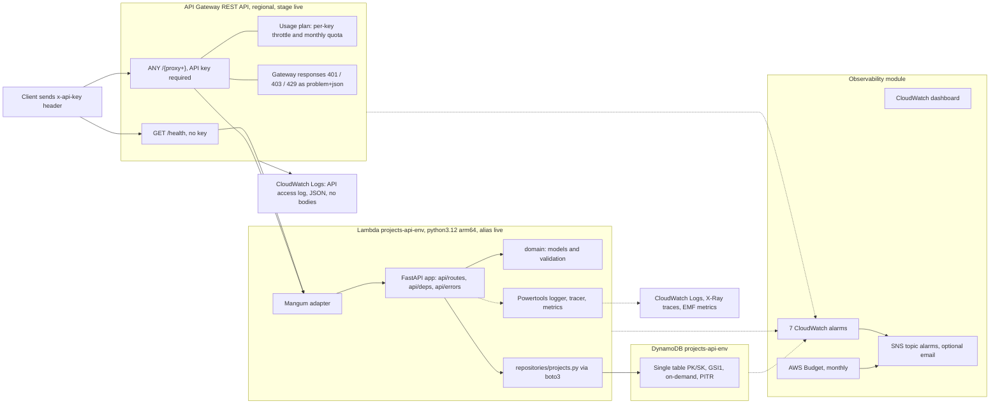

# Projects API: architecture

This document describes what is implemented in this repository today. Where a capability is
planned but not yet built, it says so and links the ticket. Decisions are recorded in
[docs/adr/](adr/). Commands and quick-start detail live in the [README](../README.md).

## Overview

The Projects API lets an API-key holder create a "project" that will later host an agent, an
MCP server or a web app. It is a serverless HTTP service on AWS, defined entirely in Terraform:
an API Gateway **REST API** (stage `live`) fronts a single **Lambda** function (Python 3.12,
arm64) that runs a **FastAPI** application through the **Mangum** adapter and persists to one
**DynamoDB** table using a single-table key design. Callers authenticate with an API key
attached to a usage plan; the key's id is the owner identity. Every non-2xx response, including
those generated by the gateway itself, is an RFC 7807 `application/problem+json` document.
An observability module wires CloudWatch alarms, a dashboard, an SNS topic and an AWS Budget
around the three runtime components. The code is in [`src/projects_api/`](../src/projects_api/),
the infrastructure in [`infra/terraform/`](../infra/terraform/).

Implemented endpoints: `GET /health` (public) and `POST /v1/projects` (key required). Read,
list and delete endpoints are later slices (see [docs/PLAN.md](PLAN.md)).

## Component diagram



Terraform wiring for the diagram is in [`infra/terraform/envs/dev/main.tf`](../infra/terraform/envs/dev/main.tf),
which composes four modules: [`dynamodb_table`](../infra/terraform/modules/dynamodb_table/main.tf),
[`lambda_api`](../infra/terraform/modules/lambda_api/main.tf),
[`api_gateway_rest`](../infra/terraform/modules/api_gateway_rest/main.tf) and
[`observability`](../infra/terraform/modules/observability/main.tf). Remote state (S3 bucket
plus DynamoDB lock table) is created once by [`infra/terraform/bootstrap/main.tf`](../infra/terraform/bootstrap/main.tf).

## Request flow: `POST /v1/projects`

1. **Gateway.** The client calls `POST https://<api-id>.execute-api.eu-west-2.amazonaws.com/live/v1/projects`
   with `x-api-key` and a JSON body. The request matches `ANY /{proxy+}`, which has
   `api_key_required = true` ([`api_gateway_rest/main.tf`](../infra/terraform/modules/api_gateway_rest/main.tf)).
   API Gateway validates the key against the usage plan and applies per-key and stage
   throttles. A missing or invalid key never reaches Lambda: the `INVALID_API_KEY` gateway
   response returns 403 problem+json; a throttled request returns 429. The request is written
   to the access log with `requestId`, `apiKeyId`, method, path, status and latency.
2. **Invoke.** The `AWS_PROXY` integration invokes the Lambda **alias** `live`
   (`lambda_invoke_arn = module.lambda.alias_invoke_arn`). The Lambda resource policy allows
   only this API's execution ARN to invoke that qualifier.
3. **Handler.** [`main.py`](../src/projects_api/main.py) `handler` is wrapped by Powertools:
   `logger.inject_lambda_context` (structured logs, event body not logged),
   `tracer.capture_lambda_handler` (X-Ray segment) and `metrics.log_metrics`
   (flushes EMF metrics, records a `ColdStart` metric). It hands the event to Mangum, which
   converts the API Gateway REST event into an ASGI request; Mangum is configured with
   `lifespan="off"` and treats `application/problem+json` as text so error bodies are not
   base64-encoded.
4. **Identity.** FastAPI resolves the `CurrentUser` dependency in
   [`api/deps.py`](../src/projects_api/api/deps.py). It reads
   `scope["aws.event"]["requestContext"]["identity"]["apiKeyId"]` and uses it as `owner_id`.
   If there is no gateway event and `ENV=local`, the `X-Api-Key-Id` header stands in.
   Otherwise the dependency raises HTTP 401.
5. **Validation.** The body is parsed into `CreateProjectRequest`
   ([`domain/models.py`](../src/projects_api/domain/models.py)): `extra="forbid"`, `type` must be
   `agent`, `mcp` or `web`, and `name` runs through `validate_name` in
   [`domain/validation.py`](../src/projects_api/domain/validation.py), the single source of the
   name rules (trim and collapse whitespace, 3 to 63 characters, letters/digits/space/hyphen/
   underscore, alphanumeric at both ends). Any failure raises `RequestValidationError`, which
   the handler in [`api/errors.py`](../src/projects_api/api/errors.py) turns into a 400 problem
   with an `errors: [{field, message}]` list.
6. **Domain object.** The route in [`api/routes/projects.py`](../src/projects_api/api/routes/projects.py)
   builds `Project.new(...)`: `projectId = prj_<uuid4 hex>`, `status = CREATED`, `createdAt`
   and `updatedAt` set to the current UTC second.
7. **Persist atomically.** `ProjectRepository.create` in
   [`repositories/projects.py`](../src/projects_api/repositories/projects.py) issues one
   `TransactWriteItems` with two `Put`s, each guarded by `ConditionExpression =
   attribute_not_exists(PK)`: the name reservation (`NAME#<nameKey>` / `RESERVATION`) and the
   project record (`PROJECT#<id>` / `META`). If the transaction is cancelled and cancellation
   reason 0 (the reservation) is `ConditionalCheckFailed`, the repository raises
   `ProjectNameTakenError`; any other failure propagates. There is no read-then-write.
8. **Respond.** On success the route emits the `ProjectsCreated` metric, logs
   `project created` with `project_id` and `type` (never the body or key), sets
   `Location: /v1/projects/<id>` and returns 201 with the project serialised in camelCase.
   `ProjectNameTakenError` is mapped to 409 by [`api/errors.py`](../src/projects_api/api/errors.py).
   Every problem response carries `requestId` (the Lambda request id) in the body and an
   `X-Request-Id` header.

## Data model

One DynamoDB table per environment (`projects-api-<env>`), defined in
[`modules/dynamodb_table/main.tf`](../infra/terraform/modules/dynamodb_table/main.tf) and mirrored
for tests in [`tests/conftest.py`](../tests/conftest.py) and for local runs in
[`scripts/create_local_table.py`](../scripts/create_local_table.py).

| Setting | Value |
|---|---|
| Keys | `PK` (hash, string), `SK` (range, string) |
| GSI1 | `GSI1PK` (hash), `GSI1SK` (range), projection `ALL` |
| Billing | `PAY_PER_REQUEST` (on-demand) |
| Durability | Point-in-time recovery enabled; deletion protection `true` only when `environment == "prod"` |
| Encryption | Server-side encryption with the AWS-owned key |
| Streams | Off by default (`stream_enabled` variable, reserved for the S4 provisioning pipeline) |

### Item types

| Item | `PK` | `SK` | Attributes |
|---|---|---|---|
| Project record | `PROJECT#<projectId>` | `META` | `entity=PROJECT`, `projectId`, `name` (display form), `nameKey` (lower-cased), `type`, `status`, `ownerId`, `createdAt`, `updatedAt`, `GSI1PK=OWNER#<ownerId>`, `GSI1SK=PROJECT#<createdAt>#<projectId>` |
| Name reservation | `NAME#<nameKey>` | `RESERVATION` | `entity=NAME_RESERVATION`, `projectId`, `ownerId`, `createdAt` |

`nameKey` is `normalise_name(name).lower()` ([`domain/validation.py`](../src/projects_api/domain/validation.py)),
so uniqueness is global and case-insensitive: `My Agent` and ` my   agent ` collide. Reservation
items carry no `GSI1PK`, so they never appear in the owner index (GSI1 is sparse).

### GSI1: owner listing

`GSI1PK = OWNER#<ownerId>` with `GSI1SK = PROJECT#<createdAt>#<projectId>` lets a `Query` return
one owner's projects in creation order (or reverse) without scanning. The repository defines the
key builders today; the `GET /v1/projects` route that queries it is S2-202.

### Why partition by project id

- **Point reads and future child items.** `GetItem` on `PROJECT#<id>` / `META` is a single
  consistent read (`ConsistentRead=True` in `ProjectRepository.get`). Later per-project items
  (deployments, resources) can share the partition under new `SK` prefixes.
- **Even distribution.** `prj_<uuid4>` spreads writes across partitions; keying by owner would
  concentrate a busy owner's traffic on one partition.
- **Uniqueness that does not depend on the owner.** The reservation item lives in its own
  partition keyed by the name, so a transaction can enforce global uniqueness across owners,
  which an owner-keyed layout or a GSI condition could not do atomically.
- **Owner access is a query, not a key.** The owner dimension is served by GSI1 instead of the
  base table, which keeps the base key stable if ownership models change.

Conventions for new entity types (a new `PK` prefix, `ConditionExpression` on every write,
transactions for multi-item writes) are in [CLAUDE.md](../CLAUDE.md).

## Error model

All non-2xx responses are `application/problem+json` with the RFC 7807 members plus
`requestId`, built by `problem()` in [`api/errors.py`](../src/projects_api/api/errors.py):

```json
{
  "type": "https://projects-api.example/problems/project-name-taken",
  "title": "Project name already exists",
  "status": 409,
  "detail": "A project named 'My Agent' already exists.",
  "instance": "/v1/projects",
  "requestId": "2f1c..."
}
```

| Status | Source | `type` suffix | Notes |
|---|---|---|---|
| 400 | FastAPI `RequestValidationError` | `validation` | Adds `errors: [{"field", "message"}]`; covers unknown fields, bad enum values, name rule failures and malformed JSON |
| 401 | `api/deps.py` when no identity can be resolved | `http-401` | In AWS the gateway normally answers first (below) |
| 401 | Gateway response `UNAUTHORIZED` | `http-401` | Rendered by API Gateway, never reaches Lambda |
| 403 | Gateway response `INVALID_API_KEY` | `http-403` | Missing or invalid `x-api-key`; this is why the smoke test expects 403 without a key |
| 404 | `ProjectNotFoundError` | `project-not-found` | Also used for resources owned by someone else (see identity model) |
| 405, 413, 415 and other Starlette `HTTPException`s | `api/errors.py` `_http` handler | `http-<status>` | Titles from the `_TITLES` table |
| 409 | `ProjectNameTakenError` | `project-name-taken` | Raised by the repository on a failed reservation condition |
| 429 | Gateway response `THROTTLED` | `http-429` | Usage-plan or stage throttle exceeded |
| 500 | Any unhandled exception | `internal` | Logged with `logger.exception`; the body contains no stack trace and asks the caller to quote `requestId` |

The gateway responses are defined in
[`modules/api_gateway_rest/main.tf`](../infra/terraform/modules/api_gateway_rest/main.tf) with
`Content-Type: application/problem+json` so clients see one error shape whether or not Lambda
was invoked. Domain exceptions live in [`domain/exceptions.py`](../src/projects_api/domain/exceptions.py);
the rule is to raise a domain error and register its mapping in `api/errors.py`, never to
build HTTP responses in repositories.

## Identity model

- **Owner = API key id.** API Gateway validates `x-api-key` against the usage plan and exposes
  the key's id as `requestContext.identity.apiKeyId`. [`api/deps.py`](../src/projects_api/api/deps.py)
  reads it from the raw event Mangum places in `scope["aws.event"]` and uses it as `ownerId`
  on every project. The key **value** is never seen by application code or logs; the access log
  records `$context.identity.apiKeyId`, not the key.
- **Onboarding.** [`scripts/create_api_key.sh`](../scripts/create_api_key.sh) creates a key,
  attaches it to the usage plan and prints the id (the `ownerId` the API will see) and the value
  once. Terraform also creates a `demo` key so a fresh stage is usable immediately.
- **Local fallback.** With no gateway event and `ENV=local`, the `X-Api-Key-Id` header is the
  identity. The fallback is disabled for any other `ENV`, so a header cannot spoof identity in
  AWS. Without either source the API returns 401.
- **404, not 403.** A resource that exists but belongs to another key is reported as
  `project-not-found` (404), never 403, so callers cannot enumerate other owners' project ids.
  The exception and mapping exist today; the first owner-scoped read is S2-201.
- **Public route.** `GET /health` has `api_key_required = false` and returns version and status.

## Well-Architected pillars

Each pillar lists concrete choices that exist in this repo, then known gaps with the ticket
that covers them.

### Security

Implemented:

- Authentication at the edge: every `/v1` route is behind `ANY /{proxy+}` with
  `api_key_required = true`; only `GET /health` is open
  ([`modules/api_gateway_rest/main.tf`](../infra/terraform/modules/api_gateway_rest/main.tf)).
- Identity taken from the gateway-populated `apiKeyId`; the header fallback is restricted to
  `ENV=local` ([`api/deps.py`](../src/projects_api/api/deps.py)).
- Least-privilege IAM: the function role has an inline policy with seven named DynamoDB actions
  on the table ARN and its indexes only, plus the AWS-managed basic execution and X-Ray write
  policies ([`modules/lambda_api/main.tf`](../infra/terraform/modules/lambda_api/main.tf)).
- Invoke permission scoped to the API's execution ARN and the `live` alias qualifier
  ([`modules/api_gateway_rest/main.tf`](../infra/terraform/modules/api_gateway_rest/main.tf)).
- No request or response bodies in logs: `data_trace_enabled = false`, an access-log format
  without body fields, `POWERTOOLS_LOGGER_LOG_EVENT=false` and `log_event=False` on the handler
  ([`main.py`](../src/projects_api/main.py)).
- Strict input validation: `extra="forbid"` request models and a single validation module
  ([`domain/models.py`](../src/projects_api/domain/models.py),
  [`domain/validation.py`](../src/projects_api/domain/validation.py)); path parameter validation
  at the gateway via a request validator.
- Encryption at rest: DynamoDB server-side encryption
  ([`modules/dynamodb_table/main.tf`](../infra/terraform/modules/dynamodb_table/main.tf)); the
  Terraform state bucket has SSE, versioning and a public access block
  ([`bootstrap/main.tf`](../infra/terraform/bootstrap/main.tf)).
- No information leakage on failure: the 500 handler returns a fixed message and the gateway
  responses are fixed documents ([`api/errors.py`](../src/projects_api/api/errors.py)).
- Secrets hygiene: `.gitignore` excludes `.env`, tfvars overrides, state and zips; the demo key
  value is a `sensitive` Terraform output.

Gaps:

- No WAF in front of the stage and no Terraform security scanning in CI:
  [S3-304](tickets/S3-304-waf-and-security-scanning.md).
- DynamoDB uses the AWS-owned key; a customer-managed KMS key is a one-line change in the module
  but is not configured.
- The `demo` API key is created by Terraform and should be disabled once real keys exist
  (procedure will be in the runbook, [S3-303](tickets/S3-303-runbook.md)).
- Problem `type` URIs use the placeholder `https://projects-api.example/problems/`.

### Reliability

Implemented:

- Atomic multi-item writes with `TransactWriteItems` and `attribute_not_exists(PK)` conditions;
  no read-then-write races on name uniqueness
  ([`repositories/projects.py`](../src/projects_api/repositories/projects.py)).
- boto3 client configured with adaptive retry mode and up to five attempts
  ([`repositories/projects.py`](../src/projects_api/repositories/projects.py)).
- Point-in-time recovery on the table; deletion protection when `environment == "prod"`
  ([`modules/dynamodb_table/main.tf`](../infra/terraform/modules/dynamodb_table/main.tf),
  [`envs/dev/main.tf`](../infra/terraform/envs/dev/main.tf)).
- Versioned Lambda (`publish = true`) behind a stable `live` alias, so rollback is repointing
  the alias to the previous version
  ([`modules/lambda_api/main.tf`](../infra/terraform/modules/lambda_api/main.tf)).
- Throttling at two levels (stage: 50 rps / 100 burst; per key: 10 rps / 20 burst, 10,000
  requests per month) and a `reserved_concurrency` variable to cap the function
  ([`modules/api_gateway_rest/variables.tf`](../infra/terraform/modules/api_gateway_rest/variables.tf),
  [`modules/lambda_api/variables.tf`](../infra/terraform/modules/lambda_api/variables.tf)).
- Alarms on Lambda errors and throttles, API 5XX, DynamoDB system errors and throttles, all
  routed to SNS ([`modules/observability/main.tf`](../infra/terraform/modules/observability/main.tf)).
- API deployment uses `create_before_destroy` and a content-hash trigger so stage updates do not
  leave a gap ([`modules/api_gateway_rest/main.tf`](../infra/terraform/modules/api_gateway_rest/main.tf)).
- Remote state with S3 versioning and a DynamoDB lock table
  ([`bootstrap/main.tf`](../infra/terraform/bootstrap/main.tf)).
- Deterministic tests: unit tests for validation and repository, integration tests through both
  `TestClient` and the Lambda `handler` against a moto table shaped like the Terraform module
  ([`tests/conftest.py`](../tests/conftest.py)).

Gaps:

- The smoke test ([`tests/smoke/smoke.sh`](../tests/smoke/smoke.sh)) has not been run against a
  deployed stage: [S1-108](tickets/S1-108-smoke-deployed-stage.md).
- No production environment yet (stricter throttles, reserved concurrency, deletion protection
  on): [S4-404](tickets/S4-404-prod-environment.md).
- Rollback is manual until the alias script lands: [S3-305](tickets/S3-305-rollback-script.md).
- Single region (eu-west-2); no multi-region or backup-restore drill.

### Performance efficiency

Implemented:

- arm64 (Graviton) runtime and a build that installs `aarch64-manylinux2014` wheels and verifies
  the native `pydantic_core` wheel is present
  ([`modules/lambda_api/main.tf`](../infra/terraform/modules/lambda_api/main.tf),
  [`scripts/build_lambda.sh`](../scripts/build_lambda.sh)).
- Key design tuned for the access patterns: single-item `GetItem` by project id, sparse GSI1
  for owner queries, no scans ([`repositories/projects.py`](../src/projects_api/repositories/projects.py)).
- Initialise once per execution environment: the FastAPI app, the Mangum adapter and the
  Powertools singletons are created at module import, not per request
  ([`main.py`](../src/projects_api/main.py), [`observability.py`](../src/projects_api/observability.py)).
- Mangum runs with `lifespan="off"` (no startup/shutdown round-trip per cold start)
  ([`main.py`](../src/projects_api/main.py)).
- Smaller package for faster cold starts: `__pycache__`, `*.dist-info` and test directories are
  pruned and `PYTHONDONTWRITEBYTECODE=1` is set
  ([`scripts/build_lambda.sh`](../scripts/build_lambda.sh)).
- Right-sizing knobs: `memory_mb` (default 512) and `timeout_seconds` (default 10) are module
  variables; the `ColdStart` metric, X-Ray active tracing on both the stage and the function,
  and a p99 duration alarm (2000 ms over three periods) give the data to tune them
  ([`modules/lambda_api/variables.tf`](../infra/terraform/modules/lambda_api/variables.tf),
  [`modules/observability/main.tf`](../infra/terraform/modules/observability/main.tf)).
- Regional API endpoint (no CloudFront hop for a single-region, key-authenticated API)
  ([`modules/api_gateway_rest/main.tf`](../infra/terraform/modules/api_gateway_rest/main.tf)).

Gaps:

- No provisioned concurrency; cold-start behaviour has not been measured on a deployed stage
  ([S1-108](tickets/S1-108-smoke-deployed-stage.md) is the first opportunity).
- Owner listing with cursor pagination (`Query` on GSI1, `ScanIndexForward=false`) is
  [S2-202](tickets/S2-202-list-projects-pagination.md).
- REST API adds more per-request latency than HTTP API; see
  [ADR 0001](adr/0001-rest-api-for-api-keys.md).

### Cost optimisation

Implemented:

- Pay-per-use everywhere: DynamoDB on-demand billing, Lambda per-invocation, no always-on
  compute ([`modules/dynamodb_table/main.tf`](../infra/terraform/modules/dynamodb_table/main.tf),
  [`modules/lambda_api/main.tf`](../infra/terraform/modules/lambda_api/main.tf)).
- arm64 Lambda is priced lower per GB-second than x86
  ([`modules/lambda_api/main.tf`](../infra/terraform/modules/lambda_api/main.tf)).
- A monthly AWS Budget (default 20 USD) filtered on the `Project=projects-api` tag, notifying at
  80% forecast and 100% actual via SNS and optional email
  ([`modules/observability/main.tf`](../infra/terraform/modules/observability/main.tf)).
- Consistent cost-allocation tags through `default_tags` on the provider plus module `tags`
  ([`envs/dev/versions.tf`](../infra/terraform/envs/dev/versions.tf),
  [`envs/dev/main.tf`](../infra/terraform/envs/dev/main.tf)).
- Bounded traffic and therefore bounded spend: usage-plan quota and throttles, stage throttles,
  optional `reserved_concurrency`
  ([`modules/api_gateway_rest/variables.tf`](../infra/terraform/modules/api_gateway_rest/variables.tf)).
- Log retention of 14 days on both the Lambda and access log groups
  ([`modules/lambda_api/variables.tf`](../infra/terraform/modules/lambda_api/variables.tf),
  [`modules/api_gateway_rest/variables.tf`](../infra/terraform/modules/api_gateway_rest/variables.tf)).
- Old Terraform state versions expire after 90 days
  ([`bootstrap/main.tf`](../infra/terraform/bootstrap/main.tf)).
- Optional cost items are opt-in: alarm email and budget can be `null`; WAF is deferred.

Gaps:

- REST API is more expensive per request than HTTP API; accepted for API keys and usage plans,
  see [ADR 0001](adr/0001-rest-api-for-api-keys.md).
- WAF adds a fixed monthly cost and is therefore behind a default-off flag when it arrives:
  [S3-304](tickets/S3-304-waf-and-security-scanning.md).
- Production budget and log sampling rate are set with the prod environment:
  [S4-404](tickets/S4-404-prod-environment.md).
- boto3 and botocore are bundled in the zip for version pinning, which enlarges the package;
  the build script documents how to drop them ([`scripts/build_lambda.sh`](../scripts/build_lambda.sh),
  [ADR 0004](adr/0004-fastapi-mangum-on-lambda.md)).

### Operational excellence

Implemented:

- Everything as code: one Terraform module per AWS concern with typed variables, composed by
  a thin environment root; bootstrap for remote state
  ([`infra/terraform/`](../infra/terraform/)).
- CI on every push to `main` and every pull request: `ruff check`, `ruff format --check`,
  `mypy --strict`, `pytest` with coverage, the arm64 zip build (uploaded as an artifact), and
  `terraform fmt -check` plus `terraform validate` for bootstrap and dev
  ([`.github/workflows/ci.yml`](../.github/workflows/ci.yml)).
- Structured logging, tracing and metrics via Powertools: `inject_lambda_context`,
  `capture_lambda_handler`, `log_metrics` with the cold-start metric, and the business metric
  `ProjectsCreated` ([`main.py`](../src/projects_api/main.py),
  [`observability.py`](../src/projects_api/observability.py),
  [`api/routes/projects.py`](../src/projects_api/api/routes/projects.py)).
- A CloudWatch dashboard with API requests/errors, API latency p50/p99, Lambda invocations/
  errors/throttles/concurrency, business metrics and DynamoDB capacity/errors; seven alarms with
  an SNS topic ([`modules/observability/main.tf`](../infra/terraform/modules/observability/main.tf)).
- Request traceability: the API access log records `requestId` and `apiKeyId`; every problem
  response carries `requestId` and an `X-Request-Id` header
  ([`modules/api_gateway_rest/main.tf`](../infra/terraform/modules/api_gateway_rest/main.tf),
  [`api/errors.py`](../src/projects_api/api/errors.py)).
- One-command workflows in the [`Makefile`](../Makefile): `lint`, `test`, `build`, `tf-fmt`,
  `tf-validate`, `tf-plan`, `tf-apply`, `smoke`, `local-db`, `run-local`.
- Operator scripts: [`scripts/create_api_key.sh`](../scripts/create_api_key.sh) for onboarding
  and [`tests/smoke/smoke.sh`](../tests/smoke/smoke.sh) for post-deploy verification.
- Repository conventions for humans and agents in [CLAUDE.md](../CLAUDE.md); tickets seeded from
  [`docs/tickets/`](tickets/) into GitHub Issues.

Gaps:

- No runbook yet (alarm playbooks, key lifecycle, Logs Insights queries):
  [S3-303](tickets/S3-303-runbook.md).
- `requestId` today is the Lambda request id, not the API Gateway `requestContext.requestId`
  that the access log records; aligning them and logging one line per request is
  [S3-302](tickets/S3-302-correlation-ids.md).
- The dashboard widget "projects created vs name conflicts" plots only `ProjectsCreated` and
  `ColdStart`; the `ProjectNameConflicts` metric is [S3-301](tickets/S3-301-conflict-metric-alarm-review.md).
- Smoke against a real stage: [S1-108](tickets/S1-108-smoke-deployed-stage.md). Rollback
  script: [S3-305](tickets/S3-305-rollback-script.md).

### Sustainability

Implemented:

- Scale-to-zero compute and storage capacity: Lambda plus on-demand DynamoDB consume nothing
  when idle ([`modules/lambda_api/main.tf`](../infra/terraform/modules/lambda_api/main.tf),
  [`modules/dynamodb_table/main.tf`](../infra/terraform/modules/dynamodb_table/main.tf)).
- arm64 Graviton, which AWS reports as more energy-efficient per unit of work than comparable
  x86 ([`modules/lambda_api/main.tf`](../infra/terraform/modules/lambda_api/main.tf)).
- Data retention limits: 14-day log retention and 90-day expiry of non-current state versions,
  so stored data does not grow unbounded
  ([`modules/lambda_api/variables.tf`](../infra/terraform/modules/lambda_api/variables.tf),
  [`bootstrap/main.tf`](../infra/terraform/bootstrap/main.tf)).
- A lean deployment artifact (`--only-binary`, `--no-compile`, pruned caches and metadata)
  reduces storage and transfer per deploy ([`scripts/build_lambda.sh`](../scripts/build_lambda.sh)).
- Single region with a regional endpoint; no edge replication or cross-region copies
  ([`modules/api_gateway_rest/main.tf`](../infra/terraform/modules/api_gateway_rest/main.tf)).
- Right-sized defaults (512 MB, 10 s timeout) with the metrics needed to tune them down
  ([`modules/lambda_api/variables.tf`](../infra/terraform/modules/lambda_api/variables.tf)).

Gaps:

- No data lifecycle for projects: delete (and releasing the name reservation) is
  [S4-401](tickets/S4-401-delete-project.md).
- Production sizing (and whether prod needs different memory or concurrency) is
  [S4-404](tickets/S4-404-prod-environment.md).
- No measurement of utilisation on a live stage yet: [S1-108](tickets/S1-108-smoke-deployed-stage.md).

## Local development and deployment (summary)

The [README](../README.md) owns the step-by-step detail; this is the shape.

- **Local loop.** `make local-db` starts DynamoDB Local in Docker
  ([`docker-compose.yml`](../docker-compose.yml)) and creates the table with
  [`scripts/create_local_table.py`](../scripts/create_local_table.py). `make run-local` runs
  uvicorn on port 8080 with `ENV=local`, so the `X-Api-Key-Id` header is the identity and the
  interactive docs are served at `/v1/docs`. `make lint` and `make test` mirror CI.
- **Build.** `make build` runs [`scripts/build_lambda.sh`](../scripts/build_lambda.sh), which
  exports the locked runtime dependencies with `uv`, installs arm64 wheels, adds
  `src/projects_api` and writes `build/lambda.zip`.
- **Deploy.** Once: `make tf-bootstrap STATE_BUCKET=<name>`, then copy
  `infra/terraform/envs/dev/backend.example.hcl` to `backend.hcl`. Per change:
  `make tf-init tf-plan tf-apply` (plan depends on `build`). Outputs include `api_url`,
  `usage_plan_id` and the sensitive `demo_api_key_value`.
- **Verify.** `make smoke` runs five checks against the deployed stage (health 200, no key 403,
  create 201, duplicate 409, invalid name 400). Onboard further users with
  `scripts/create_api_key.sh <label>`.

## Decision records

- [ADR 0001: REST API for API keys and usage plans](adr/0001-rest-api-for-api-keys.md)
- [ADR 0004: FastAPI with Mangum on a single Lambda](adr/0004-fastapi-mangum-on-lambda.md)
- ADR 0002 (single-table design) and ADR 0003 (global name uniqueness) are written under
  [S1-107](tickets/S1-107-readme-adr-0002-0003.md); ADR 0005 (provisioning design) under
  [S4-403](tickets/S4-403-adr-provisioning-design.md).
